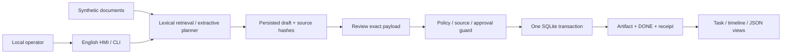

# Architecture and failure boundaries

New4 Base combines a Python durable control plane with a stateless Go process provider. `workers.py` admits only `onion.parse`, `search.rank`, `math.sum` and `graph.route`, imposes a three-second runtime budget and checks the response protocol. This is logical tool confinement, not an OS sandbox. Workers never approve local effects.

Sources enter a named case through local notes/folders, bounded public cloud excerpts or a selected loopback corpus API. The crawler/harvester and hydrator share the same source table; there is no second graph/database. A task carries its case, source generation, dictionary generation, onion layers and ranked evidence. Dictionary revisions and source changes invalidate approval applicability.

Exact-case lexical nodes, explicit case meanings, document-reference edges, tasks, worker/provider agents and engineering/QA lenses form a versioned work capsule. A work folder is a generated capsule projection. Room/Board/Work and zero-agent-authority design indicators live in `contracts/room.json`; no connected LLM or calibrated utility is implied.

The artifact sink, approval records, task state and receipts share one SQLite database. `BEGIN IMMEDIATE` serializes writers. `WAL` and `synchronous=FULL` configure persistence; their hardware assumptions still apply. A process exit does not imply a storage power-loss experiment.

## Failure matrix

| Boundary | Durable state after restart | Next action | Evidence |
|---|---|---|---|
| Before approval | AWAITING_APPROVAL | Review current draft | Approval denial / positive control |
| Source changes after approval | AWAITING_APPROVAL, old source version | Reprepare and reapprove | Source revision scenario |
| Kill after artifact INSERT, before COMMIT | Previous committed state, no artifact | Execute with preserved approval | Parent kills real worker process |
| Kill after COMMIT, before acknowledgment | DONE with artifact and receipt | Verify and return existing artifact | Parent kills real worker process |
| Six simultaneous workers | One committed artifact | Others return existing result | Six separate OS processes |
| Cancellation before effect | CANCELLED, no artifact | Terminal, no automatic resume | Restart / cancellation scenario |
| Tamper with retained receipt | Verification rejects changed hash chain | Investigate retained data | Mutation scenario |

## Hard constraints

An idempotency key is the task ID. Reusing it with a different query is a conflict. Approval binds the query, complete corpus generation, selected source hashes, draft, planner version and policy hash through one payload digest. The operator must inspect the draft; the runtime cannot establish that inspection actually happened.

Documents are passive strings, including malicious-looking instructions. The planner cannot select a tool or create approval. Source changes are conservatively handled at full-corpus granularity, even if the changed document was not selected. This is simple and safe for a fixture; it can cause unnecessary reapproval at larger scale.

There is no durable dispatch marker for a remote effect because there is no remote effect. Adding a separate email/file/network sink would create a new failure window. An outbox, downstream idempotency, receipt reconciliation and explicit UNKNOWN outcomes would need separate implementation and evaluation.

The chain is a local consistency check. Its head is neither signed nor externally anchored. Rewriting the entire database into a consistent fabricated history, or truncating a chain consistently, is outside the threat model.

Machine contracts live in `contracts/`; result schemas in `schemas/`. The JSON report is the measurement source; human-readable evidence is derived from it by `scripts/project.py`.
